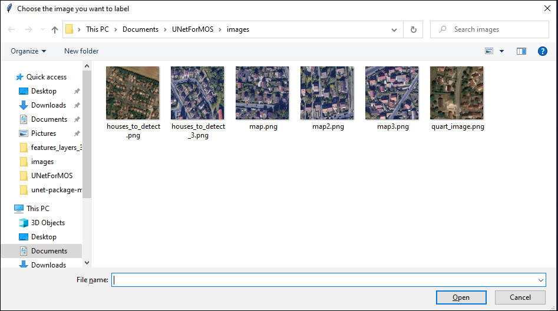
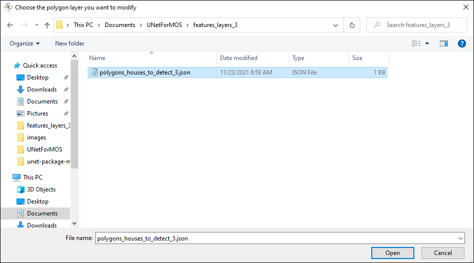
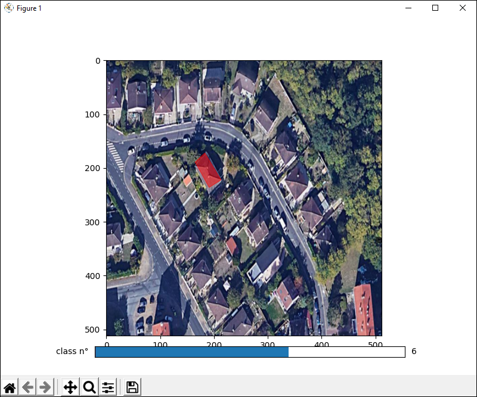
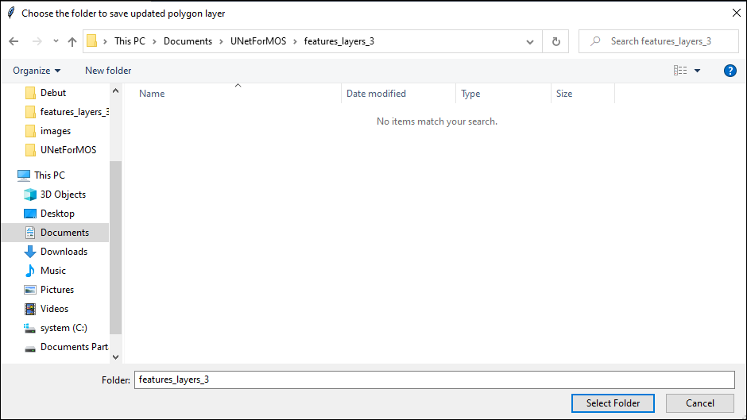
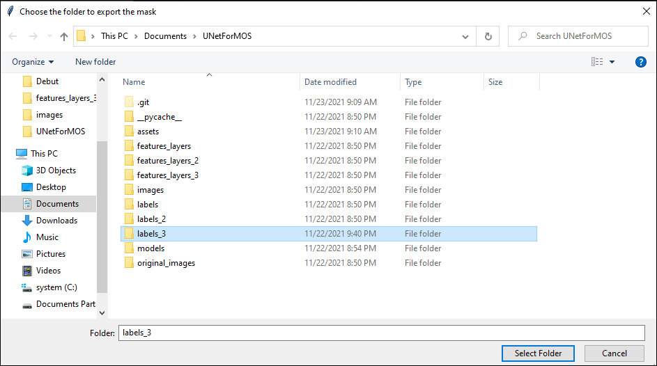

# UNetForMOS

## Description

This project allows you to easily label pictures to train deep learning segmentation models. In this project the model implemented is UNet.

## Quick installation

To install required dependencies please enter the following command in the root folder of the project
```
pip install -r requirements.txt
```

## Polygons Editor Manual

Launch the Interface from the root folder with the following command : 

```
python ./PolyInterfaceUpdate.py
```

### First Step : Choose the image you want to label


<p align="center">

 </p>


### Second Step : Load a pre-existing polygon layer with the image


<p align="center">

 </p>
 
 
### Third Step : Choose your class number by sliding the below horizontal bar and draw polygons


<p align="center">

 </p>
 
 
### Fourth Step : Choose a folder to save the new ploygon layer


<p align="center">

 </p>
 
 
### Fiveth Step : Choose a folder to export the mask of this layer


<p align="center">

</p>

## Train and Test UNet


### Train : 


To train your Neural Network we need to specify the folder with your images and the folder with your labels. We need to have one label file by image.
Then you must run the following command from the project root directory.
```
python train.py
```

### Test : 


The test script only shows network segmentation for the image that you specified in the script. Furthermore, it only shows you the result but it doesn't save it.
To test the Network, launch the command :
```
python test.py
```
